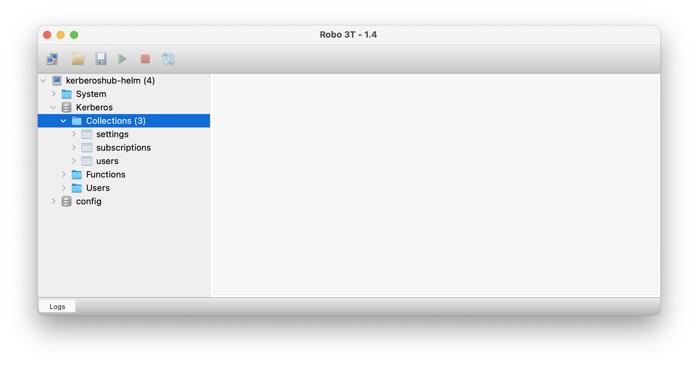

# Kerberos Hub

Kerberos Hub is the single pane of glass for your Kerberos agents. It comes with a best of breed open source technology stack, modular and scale first mindset, and allows you to build and maintain an everless growing video surveillance and video analytics landscape.

## License

To use Kerberos Hub a license is required. This license will grant access the Kerberos Hub API, and allow to connect a number of cameras and Kerberos Vaults.

## Add helm repos

The Kerberos Hub installation makes use of this Helm chart. Therefore, we will add those repos to our Kubernetes cluster.

    helm repo add kerberos https://charts.kerberos.io
    helm repo update

## Prerequisites

Go and follow the Kerberos Hub installation at the [hub repository](https://github.com/kerberos-io/hub). Once you have [installed all prerequisites](https://github.com/kerberos-io/helm-charts/tree/main/charts/hub#lets-give-it-a-try) come back here.

## Kerberos Hub 

So once you hit this step, you should have installed all required dependencies. Hopefully you didn't had too much pain with the certificates. Before starting, it's important to have a look at the `values.yaml` file. This includes the different parameters to configure the different deployments. Reach out to us if you would need any help with this.

Install the Kerberos Hub chart in a specific namespace and take into the values.yaml file.

    helm install hub kerberos/hub --values values.yaml -n kerberos-hub --create-namespace

Uninstall the Kerberos Hub chart

    helm uninstall hub -n kerberos-hub

### Parameters

Below all configuration options and parameters are listed.

| Name                                          | Description                                                                                                               | Value |
| --------------------------------------------- | ------------------------------------------------------------------------------------------------------------------------- | ----- |
| `license`                                     | The license key you received from support@kerberos.io. If not available request one.                                      | `""`  |
| `licenseServer.url`                           | The license server for validating the license of your Kerberos Hub, by default `'"https://license.kerberos.io/verify"'`.  | `""`  |
| `licenseServer.token`                         | The license server API token to sign the license validation by default `'214%ˆ#ddfsf@#3rfdsgl_)23sffeqasSwefDSFNBM'`.     | `""`  |
| `imagePullSecrets.name`                       | Docker registry secret name, which is also granted with the license. This allows you to download the Docker images.       | `""`  |
| `isPrivate`                                   | Global StorageClass for Persistent Volume(s)                                                                              | `""`  |
| `readOnly`                                    | This will stop any write process to mongodb or any processing done in the Kerberos Hub pipeline.                          | `""`  |
| `ingress`                                     | The ingress being used for `kerberoshub.api.url` and `kerberoshub.frontend.url`.                                          | `""`  |
| `mongodb.host`                                | MongoDB hostname (`'mongodb:27017'`) or mongodb replicas (`'mongodb-0:27017,mongodb-1:27017'`).                           | `""`  |
| `mongodb.adminDatabase`                       | MongoDB admin database, this is named `admin` by default.                                                                 | `""`  |
| `mongodb.username`                            | MongoDB user account, we are using in the hub installation `'root'`.                                                      | `""`  |
| `mongodb.password`                            | MongoDB user password, by default `'yourmongodbpassword'`                                                                 | `""`  |
| `mqtt.host`                                   | MQTT (Vernemq) hostname.                                                                                                  | `""`  |
| `mqtt.port`                                   | MQTT (Vernemq) port for WSS (secure sockets), by default `'8443'`.                                                        | `""`  |
| `mqtt.protocol`                               | MQTT (Vernemq) protocol, by default `'wss'`.                                                                              | `""`  |
| `mqtt.username`                               | MQTT (Vernemq) username, by default `'yourusername'`.                                                                     | `""`  |
| `mqtt.password`                               | MQTT (Vernemq) password, by default `'yourpassword'`.                                                                     | `""`  |
| `queueProvider`                               | The queue we are using for the [Kerberos Hub pipeline](https://doc.kerberos.io/hub/pipeline/), can be 'SQS' or 'KAFKA'.   | `""`  |
| `queueName`                                   | The event queue which is propagating messages in the [Kerberos Hub pipeline](https://doc.kerberos.io/hub/pipeline/).      | `""`  |
| `kafka.broker`                                | Kafka brokers, by default `'kafka1.yourdomain.com:9094,kafka2.yourdomain.com:9094'`                                       | `""`  |
| `kafka.username`                              | Kafka username, by default `'yourusername'`                                                                               | `""`  |
| `kafka.password`                              | Kafka password, by default `'yourpassword'`                                                                               | `""`  |
| `kafka.mechanism`                             | Kafka mechanism, by default `'PLAIN'`                                                                                     | `""`  |
| `kafka.security`                              | Kafka security, by default `'SASL_PLAINTEXT'`                                                                             | `""`  |
| `turn.host`                                   | TURN/STUN hostname, by default `'turn:turn.yourdomain.com:8443'`                                                          | `""`  |
| `turn.username`                               | TURN/STUN username, by default `'username1'`                                                                              | `""`  |
| `turn.password`                               | TURN/STUN password, by default `'password1'`                                                                              | `""`  |
| `kerberosvault.uri`                           | The default Kerberos Vault uri (you can add multiple within the app), by default `'https://api.storage.yourdomain.com'`   | `""`  |
| `kerberosvault.accesskey`                     | The default Kerberos Vault access key, by default `'xxx'`                                                                 | `""`  |
| `kerberosvault.secretkey`                     | The default Kerberos Vault secret key, by default `'xxx'`                                                                 | `""`  |
| `kerberosvault.provider`                      | The default Kerberos Vault provider`'a-provider'`                                                                                | `""`  |
| `kerberosvault.archive.accesskey`             | When a task is created, the relevant recording is moved to another provider, using this access key `'xxx'`                                                                                | `""`  |
| `kerberosvault.archive.secretkey`             | When a task is created, the relevant recording is moved to another provider, using this secret key`'xxx'`                                                                                | `""`  |
| `kerberosvault.archive.provider`              | When a task is created, the relevant recording is moved to this provider `'an-archive-provider'`                                                                                | `""`  |
| `email.provider`                              | The email service provider for sending out messages over email , use `'mailgun'` or `'smtp'`.                             | `""`  |
| `email.from`                                  | The email address that is sending messages in name of, by default `'support@yourdomain.com'`.                             | `""`  |
| `email.displayName`                           | The display name that is sending messages in name of, by default `'yourdomain.com'`                                       | `""`  |
| `email.mailgun.domain`                        | While using `mailgun` as email service provider, you will need to provide your Mailgun domain.                            | `""`  |
| `email.mailgun.apiKey`                        | The Mailgun API key linked to your Mailgun domain.                                                                        | `""`  |
| `email.smtp.server`                           | While using `smtp` as email service provider, use the SMTP server.                                                        | `""`  |
| `email.smtp.port`                             | SMTP port specified by your SMTP server, by default `'456'`.                                                              | `""`  |
| `email.smtp.username`                         | SMTP username.                                                                                                            | `""`  |
| `email.smtp.password`                         | SMTP password.                                                                                                            | `""`  |
| `email.templates.detection`                   | We use templates to send notifications, this allow you to bring your own `Mailgun` templates, by default `'detection'`.   | `""`  |
| `email.templates.disabled`                    | The template which is send when an account is disabled due to reaching its upload limit, by default `'disabled'`.         | `""`  |
| `email.templates.highupload`                  | The template which is send when an account is reaching a specific upload threshold, by default `'threshold'`.             | `""`  |
| `email.templates.device`                      | The template which is send when a camera goes online or offline, by default `'device'`.                                   | `""`  |
| `email.templates.welcome`                     | The template which is send when a new user registered on the platform (`IS_PRIVATE='false'`), by default `'disabled'`.    | `""`  |
| `email.templates.welcomeTitle`                | The welcome title use in the subject of the email.                                                                        | `""`  |
| `email.templates.activate`                    | The template which is send when a user is required to activate his account , by default `'activate'`.                     | `""`  |
| `email.templates.activateTitle`               | The activation title use in the subject of the email.                                                                     | `""`  |
| `email.templates.forgot`                      | The template which is send when an account is requesting a forgot password, by default `'forgot'`.                        | `""`  |
| `email.templates.forgotTitle`                 | The forgot title use in the subject of the email.                                                                         | `""`  |
| `kerberoshub.api.repository`                  | The Docker registry where the Kerberos Hub API container is hosted.                                                       | `""`  |
| `kerberoshub.api.pullPolicy`                  | The Docker registry pull policy.                                                                                          | `""`  |
| `kerberoshub.api.tag`                         | The Docker image tag/version.                                                                                             | `""`  |
| `kerberoshub.api.replicas`                    | The number of pods/replicas running for the Kerberos Hub API deployment.                                                  | `""`  |
| `kerberoshub.api.jwtSecret`                   | A secret that is for generating JWT tokens.                                                                               | `""`  |
| `kerberoshub.api.schema`                      | The protocol to serve the Kerberos Hub API, `'http'` or `'https'`.                                                        | `""`  |
| `kerberoshub.api.url`                         | The Kerberos Hub API ingress to access the API.                                                                           | `""`  |
| `kerberoshub.api.tls`                         | Bring your own TLS certificates for Kerberos Hub API ingress.                                                             | `""`  |
| `kerberoshub.api.language`                    | The language of Kerberos Hub API responses, error messages will be communicated in the specified language.                | `""`  |
| `kerberoshub.api.fallbackLanguage`            | The fallback language, if a specific translation is not available.                                                        | `""`  |
| `kerberoshub.api.slack.enabled`               | Slack integration for sending events and notifications coming from the Kerberos Hub API, `'true'` or `'false'`.           | `""`  |
| `kerberoshub.api.slack.hook`                  | Slack integration hook url.                                                                                               | `""`  |
| `kerberoshub.api.slack.username`              | Slack integration username.                                                                                               | `""`  |
| `kerberoshub.api.elasticsearch.enabled`       | Elasticsearch for storing events coming from the Kerberos Hub API, `'true'` or `'false'`                                  | `""`  |
| `kerberoshub.api.elasticsearch.protocol`      | Elasticsearch protocol, `'http'` or `'https'`.                                                                            | `""`  |
| `kerberoshub.api.elasticsearch.host`          | Elasticsearch host.                                                                                                       | `""`  |
| `kerberoshub.api.elasticsearch.port`          | Elasticsearch port.                                                                                                       | `""`  |
| `kerberoshub.api.elasticsearch.index`         | Elasticsearch index which is used to store the events.                                                                    | `""`  |
| `kerberoshub.api.elasticsearch.username`      | Elasticsearch username.                                                                                                   | `""`  |
| `kerberoshub.api.elasticsearch.password`      | Elasticsearch password.                                                                                                   | `""`  |
| `kerberoshub.api.sso.issuer`                  | Kerberos Hub can be linked to OpenID Connect for SSO. Specify the OIC issuer.                                             | `""`  |
| `kerberoshub.api.sso.clientId`                | The OIC client id.                                                                                                        | `""`  |
| `kerberoshub.api.sso.clientSecret`            | The OIC client secret.                                                                                                    | `""`  |
| `kerberoshub.api.sso.redirectUrl`             | The OIC redirectUrl, once the authentication is validated.                                                                | `""`  |
| `kerberoshub.frontend.repository`             | The Docker registry where the Kerberos Hub frontend is hosted.                                                            | `""`  |
| `kerberoshub.frontend.pullPolicy`             | The Docker registry pull policy.                                                                                          | `""`  |
| `kerberoshub.frontend.tag`                    | The Docker image tag/version.                                                                                             | `""`  |
| `kerberoshub.frontend.replicas`               | The number of pods/replicas running for the Kerberos Hub frontend deployment.                                             | `""`  |
| `kerberoshub.frontend.schema`                 | The protocol to serve the Kerberos Hub frontend, `'http'` or `'https'`.                                                   | `""`  |
| `kerberoshub.frontend.url`                    | The Kerberos Hub frontend ingress to access the frontend.                                                                 | `""`  |
| `kerberoshub.frontend.tls`                    | Bring your own TLS certificates for Kerberos Hub frontend ingress.                                                        | `""`  |
| `kerberoshub.frontend.ssoDomain`              | The domain that's being used to activate SSO from the login page.                                                         | `""`  |
| `kerberoshub.frontend.logo`                   | The logo being used in the Kerberos Hub frontend, set to 'custom' if you want to mount your own stylesheet.               | `""`  |
| `kerberoshub.frontend.mixpanel.apikey`        | No longer used.                                                                                                           | `""`  |
| `kerberoshub.frontend.sentry.url`             | No longer used.                                                                                                           | `""`  |
| `kerberoshub.frontend.posthog.key`            | The API key retrieved from the Posthog instance.                                                                          | `""`  |
| `kerberoshub.frontend.posthog.url`            | Posthog's endpoint (http/https).                                                                                          | `""`  |
| `kerberoshub.frontend.stripe.apikey`          | If using the public version, `stripe` can be used for automated billing and subscriptions.                                | `""`  |
| `kerberoshub.frontend.googlemaps.apikey`      | Within Kerberos Hub frontend a couple of maps are being used, the google maps is leveraged for that.                      | `""`  |
| `kerberoshub.frontend.zendesk.url`            | No longer used.                                                                                                           | `""`  |
| `kerberoshub.frontend.zendesk.url`            | No longer used.                                                                                                           | `""`  |
| `kerberoshub.cleanup.repository`              | The Docker container that is responsible for cleaning up the Kerberos Hub API content and related MongoDB collections.    | `""`  |
| `kerberoshub.cleanup.pullPolicy`              | The Docker registry pull policy.                                                                                          | `""`  |
| `kerberoshub.cleanup.tag`                     | The Docker image tag/version.                                                                                             | `""`  |
| `kerberoshub.forwarder.repository`            | The Docker container which orchestrates forwarding coming from different Kerberos Vaults.                                 | `""`  |
| `kerberoshub.forwarder.pullPolicy`            | The Docker registry pull policy.                                                                                          | `""`  |
| `kerberoshub.forwarder.tag`                   | The Docker image tag/version.                                                                                             | `""`  |
| `kerberoshub.monitordevice.repository`        | The monitoring microservice, following up the status of your cameras and Kerberos Agents.                                 | `""`  |
| `kerberoshub.monitordevice.pullPolicy`        | The Docker registry pull policy.                                                                                          | `""`  |
| `kerberoshub.monitordevice.tag`               | The Docker image tag/version.                                                                                             | `""`  |
| `kerberospipeline.event.repository`           | The [event orchestration](https://doc.kerberos.io/hub/pipeline/#orchestrator) microservice.                               | `""`  |
| `kerberospipeline.event.pullPolicy`           | The Docker registry pull policy.                                                                                          | `""`  |
| `kerberospipeline.event.tag`                  | The Docker image tag/version.                                                                                             | `""`  |
| `kerberospipeline.monitor.repository`         | The [monitoring microservice](https://doc.kerberos.io/hub/pipeline/#monitoring), calculating metrics of incoming messages.| `""`  |
| `kerberospipeline.monitor.pullPolicy`         | The Docker registry pull policy.                                                                                          | `""`  |
| `kerberospipeline.monitor.tag`                | The Docker image tag/version.                                                                                             | `""`  |
| `kerberospipeline.sequence.repository`        | The [sequencer microservice](https://doc.kerberos.io/hub/pipeline/#sequencer), grouping recordings in chunks/groups.      | `""`  |
| `kerberospipeline.sequence.pullPolicy`        | The Docker registry pull policy.                                                                                          | `""`  |
| `kerberospipeline.sequence.tag`               | The Docker image tag/version.                                                                                             | `""`  |
| `kerberospipeline.throttler.repository`       | The [throttler microservice](https://doc.kerberos.io/hub/pipeline/#throttler), throttling events.                         | `""`  |
| `kerberospipeline.throttler.pullPolicy`       | The Docker registry pull policy.                                                                                          | `""`  |
| `kerberospipeline.throttler.tag`              | The Docker image tag/version.                                                                                             | `""`  |
| `kerberospipeline.notify.repository`          | The [notification microservice](https://doc.kerberos.io/hub/pipeline/#notification), sending notifications on events.     | `""`  |
| `kerberospipeline.notify.pullPolicy`          | The Docker registry pull policy.                                                                                          | `""`  |
| `kerberospipeline.notify.tag`                 | The Docker image tag/version.                                                                                             | `""`  |
| `kerberospipeline.notifyTest.repository`      | The notification service for testing, the different channels.                                                             | `""`  |
| `kerberospipeline.notifyTest.pullPolicy`      | The Docker registry pull policy.                                                                                          | `""`  |
| `kerberospipeline.notifyTest.tag`             | The Docker image tag/version.                                                                                             | `""`  |
| `kerberospipeline.analysis.repository`        | The [analysis microservices](https://doc.kerberos.io/hub/pipeline/#analyser) which executed specific analysis in parallel.| `""`  |
| `kerberospipeline.analysis.pullPolicy`        | The Docker registry pull policy.                                                                                          | `""`  |
| `kerberospipeline.analysis.tag`               | The Docker image tag/version.                                                                                             | `""`  |
| `kerberospipeline.dominantColor.repository`   | The dominant color microservices is computing a top 3 color histogram.                                                    | `""`  |
| `kerberospipeline.dominantColor.pullPolicy`   | The Docker registry pull policy.                                                                                          | `""`  |
| `kerberospipeline.dominantColor.tag`          | The Docker image tag/version.                                                                                             | `""`  |
| `kerberospipeline.thumbnail.repository`       | The thumbnail microservices generated a thumbnail for a recordings.                                                       | `""`  |
| `kerberospipeline.thumbnail.pullPolicy`       | The Docker registry pull policy.                                                                                          | `""`  |
| `kerberospipeline.thumbnail.tag`              | The Docker image tag/version.                                                                                             | `""`  |
| `kerberospipeline.counting.repository`        | The counting microservices computes objects passing different line segments.                                              | `""`  |
| `kerberospipeline.counting.pullPolicy`        | The Docker registry pull policy.                                                                                          | `""`  |
| `kerberospipeline.counting.tag`               | The Docker image tag/version.                                                                                             | `""`  |
### Post installation

After the installation you'll need to initialise the Mongodb with some objects. Have a look at the `mongodb/` folder, you'll find three files available:

- settings.nosql
- subscriptions.nosql
- users.nosql

Open your favourite Mongodb client (or cli) and connect to your Mongodb database as previously created (or have already installed). Import the previous mentioned `.nosql` files into a new database called `Kerberos`.

Once done you should be able to sign in with following credentials:

- username: youruser
- password: yourpassword

Please note that the default username and password can be changed [by the changing the related username and password hash](https://github.com/kerberos-io/hub/blob/master/mongodb/users.nosql#L3-L5). The password hash is a bcrypt computed hash, which you can compute yourself [using a bcrypt client](https://bcrypt-generator.com/).

### Subscription settings

Once the collections are loaded in the Mongodb instance, you should see the `user`, `subscriptons` and `settings` collections. Those three collections will allow a user to login into the Kerberos Hub web interface, using the previously mentioned username and password. 

Next to that, in the `subscriptions` collection you will find a subscription for that specific user. The subscription specifies which kind of access the user has in terms of features and upload quota. 

Building further on those `subscriptions`, you will find a `settings` collection that contains the quota for each `subscription`.

### Indexing

Following indexes should be executed on the MongoDB database (Kerberos) to improve future performance.

    db.getCollection('sequences').createIndex({user_id:1, end:1, start: -1, devices: 1})

    db.getCollection('sequences').createIndex({user_id:1, end:1, start: 1, "images.instanceName": 1})
    
    db.getCollection('sequences').createIndex({user_id:1, "images.key":1})

    db.getCollection("notifications").createIndex({"user":1})

    db.getCollection("analysis").createIndex({"key":1})

# Upgrade

After installation, you might want to upgrade Kerberos Hub to the latest version, or change some settings. With Helm charts all settings are configured through the `values.yaml` file. After you made modifications to the `values.yaml` file, for example the version tag, or a new DNS name, you can run the `helm upgrade` command as following.

    helm upgrade hub kerberos/hub -f values.yaml -n kerberos-hub

The first argument is the helm project name, you could find this out by running `helm ls -n kerberos`. The following element is the helm chart name, and the last one is the `values.yaml` file with the new configuration.

# Building

To build a new release the following steps needs to be executed. Please note that this repository has a Github action which automatically releases new a Helm chart version.

    cd hub
    helm lint 

    cd ..
    helm package hub
    mv hub-*.tgz hub

    helm repo index hub --url https://charts.kerberos.io/hub
    cd hub
    cat index.yaml
    
