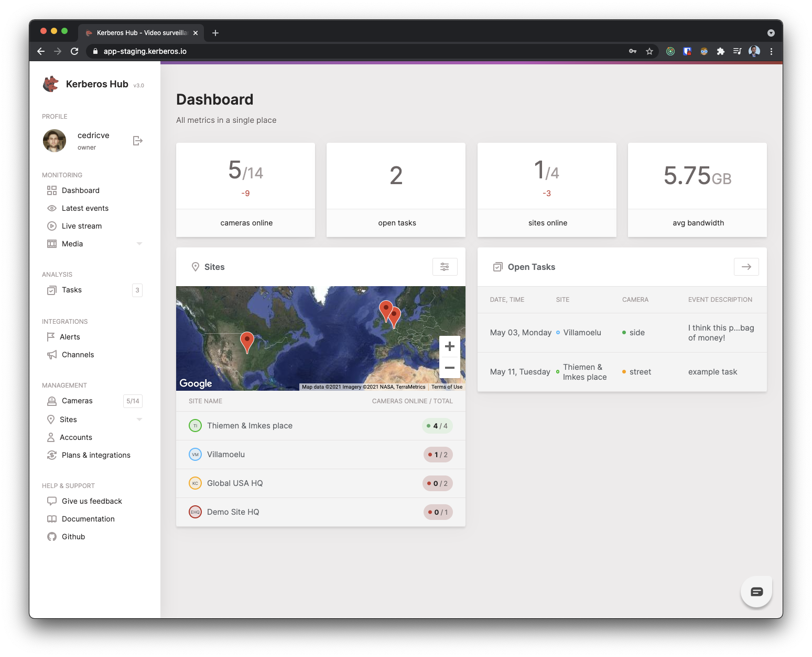
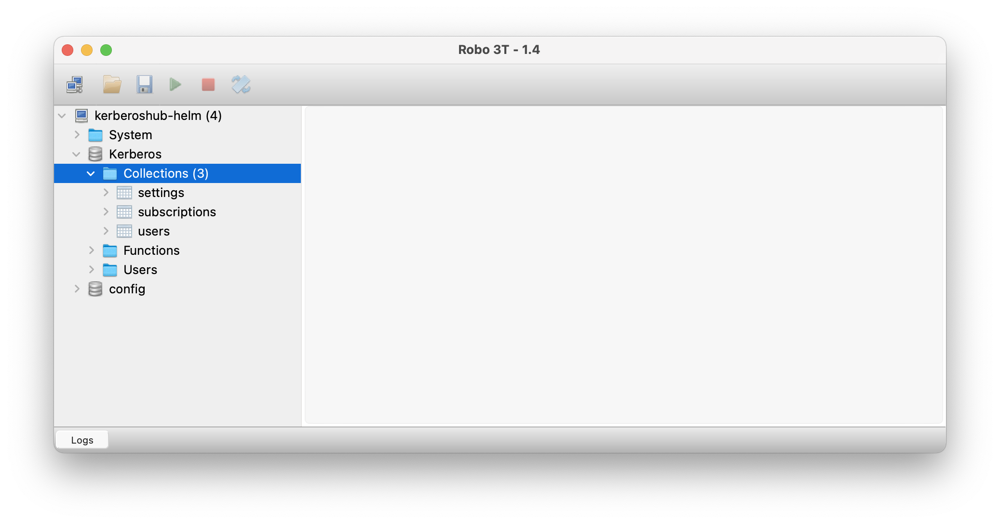

# Kerberos Hub

Kerberos Hub is the single pane of glass for your Kerberos agents. It comes with a best of breed open source technology stack, modular and scale first mindset, and allows you to build and maintain an everless growing video surveillance and video analytics landscape.

## License

To use Kerberos Hub a license is required. This license will grant access the Kerberos Hub API, and allow to connect a number of cameras and Kerberos Vaults.

## Add helm repos

The Kerberos Hub installation makes use of this Helm chart. Therefore, we will add those repos to our Kubernetes cluster.

    helm repo add kerberos https://charts.kerberos.io
    helm repo update

## Prerequisites

Go and follow the Kerberos Hub installation at the [hub repository](https://github.com/kerberos-io/hub). Once you have [installed all prerequisites](https://github.com/kerberos-io/helm-charts/tree/main/charts/hub#lets-give-it-a-try) come back here.

## Kerberos Hub

So once you hit this step, you should have installed all required dependencies. Hopefully you didn't had too much pain with the certificates. Before starting, it's important to have a look at the `values.yaml` file. This includes the different parameters to configure the different deployments. Reach out to us if you would need any help with this.

Install the Kerberos Hub chart in a specific namespace and take into the values.yaml file.

    helm install hub kerberos/hub --values values.yaml -n kerberos-hub --create-namespace

Uninstall the Kerberos Hub chart

    helm uninstall hub -n kerberos-hub

### Parameters

Below all configuration options and parameters are listed.

| Name                                        | Description                                                                                                                | Value |
| ------------------------------------------- | -------------------------------------------------------------------------------------------------------------------------- | ----- |
| `license` | The license key you received from support@kerberos.io. If not available request one. | `""` |
| `licenseServer.url` | The license server for validating the license of your Kerberos Hub, by default `'"https://license.kerberos.io/verify"'`. | `""` |
| `licenseServer.token` | The license server API token to sign the license validation by default `'214%ˆ#ddfsf@#3rfdsgl_)23sffeqasSwefDSFNBM'`. | `""` |
| `environment` | A colored banner will be shown on top of the application to illustrate a non-production environment: `staging`, `demo`, .. | `""` |
| `isPrivate` | Global StorageClass for Persistent Volume(s) | `""` |
| `readOnly` | This will stop any write process to mongodb or any processing done in the Kerberos Hub pipeline. | `""` |
| `global.imageRegistry` | Global container registry override used for all images. | `""` |
| `ingress` | The ingress being used for `kerberoshub.api.url` and `kerberoshub.frontend.url`. | `""` |
| `mongodb.host` | MongoDB hostname (`'mongodb:27017'`) or mongodb replicas (`'mongodb-0:27017,mongodb-1:27017'`). | `""` |
| `mongodb.adminDatabase` | MongoDB admin database, this is named `admin` by default. | `""` |
| `mongodb.authenticationMechanism` | MongoDB authentication mechanism (for example `SCRAM-SHA-256`). | `""` |
| `mongodb.username` | MongoDB user account, we are using in the hub installation `'root'`. | `""` |
| `mongodb.password` | MongoDB user password, by default `'yourmongodbpassword'` | `""` |
| `mongodb.retryWrites` | Enable or disable MongoDB retryable writes. | `""` |
| `mqtt.host` | MQTT (Vernemq) hostname. | `""` |
| `mqtt.port` | MQTT (Vernemq) port for WSS (secure sockets), by default `'8443'`. | `""` |
| `mqtt.protocol` | MQTT (Vernemq) protocol, by default `'wss'`. | `""` |
| `mqtt.username` | MQTT (Vernemq) username, by default `'yourusername'`. | `""` |
| `mqtt.password` | MQTT (Vernemq) password, by default `'yourpassword'`. | `""` |
| `mqtt.legacy.host` | Legacy MQTT broker host used for backward-compatible clients. | `""` |
| `mqtt.legacy.port` | Legacy MQTT broker port used for backward-compatible clients. | `""` |
| `queueProvider` | The queue we are using for the [pipeline](https://doc.kerberos.io/hub/pipeline/): 'SQS', 'KAFKA' or `RABBITMQ`. | `""` |
| `queueName` | The event queue which is propagating messages in the [Kerberos Hub pipeline](https://doc.kerberos.io/hub/pipeline/). | `""` |
| `rabbitmq.host` | RabbitMQ host, by default `'rabbitmq.yourdomain.com:5671'` | `""` |
| `rabbitmq.username` | RabbitMQ username, by default `'yourusername'` | `""` |
| `rabbitmq.password` | RabbitMQ password, by default `'yourpassword'` | `""` |
| `rabbitmq.exchange` | RabbitMQ exchange, by default `''` | `""` |
| `kafka.broker` | Kafka brokers, by default `'kafka1.yourdomain.com:9094,kafka2.yourdomain.com:9094'` | `""` |
| `kafka.username` | Kafka username, by default `'yourusername'` | `""` |
| `kafka.password` | Kafka password, by default `'yourpassword'` | `""` |
| `kafka.mechanism` | Kafka mechanism, by default `'PLAIN'` | `""` |
| `kafka.security` | Kafka security, by default `'SASL_PLAINTEXT'` | `""` |
| `turn.host` | TURN/STUN hostname, by default `'turn:turn.yourdomain.com:8443'` | `""` |
| `turn.username` | TURN/STUN username, by default `'username1'` | `""` |
| `turn.password` | TURN/STUN password, by default `'password1'` | `""` |
| `opentelemetry.enabled` | Enable or disable OpenTelemetry instrumentation. | `""` |
| `opentelemetry.routingEnabled` | Enable or disable OpenTelemetry routing/export behavior. | `""` |
| `opentelemetry.collector.endpoint` | OpenTelemetry collector endpoint used for trace export. | `""` |
| `openai.enabled` | Enable or disable OpenAI-backed semantic features. | `""` |
| `openai.apikey` | OpenAI API key used when OpenAI integration is enabled. | `""` |
| `kerberosvault.uri` | The default Kerberos Vault uri (you can add multiple within the app), by default `'https://api.storage.yourdomain.com'` | `""` |
| `kerberosvault.provider` | The default Kerberos Vault provider`'a-provider'` | `""` |
| `kerberosvault.accesskey` | The default Kerberos Vault access key, by default `'xxx'` | `""` |
| `kerberosvault.secretkey` | The default Kerberos Vault secret key, by default `'xxx'` | `""` |
| `kerberosvault.archive.provider` | When a task is created, the relevant recording is moved to this provider `'an-archive-provider'` | `""` |
| `kerberosvault.archive.accesskey` | When a task is created, the relevant recording is moved to another provider, using this access key `'xxx'` | `""` |
| `kerberosvault.archive.secretkey` | When a task is created, the relevant recording is moved to another provider, using this secret key`'xxx'` | `""` |
| `kerberosvault.thumbnail.provider` | Configuration value for `kerberosvault.thumbnail.provider`. | `""` |
| `kerberosvault.thumbnail.accessKey` | Access key for `kerberosvault.thumbnail`. | `""` |
| `kerberosvault.thumbnail.secretKey` | Secret key for `kerberosvault.thumbnail`. | `""` |
| `kerberosvault.sprite.provider` | Configuration value for `kerberosvault.sprite.provider`. | `""` |
| `kerberosvault.sprite.accessKey` | Access key for `kerberosvault.sprite`. | `""` |
| `kerberosvault.sprite.secretKey` | Secret key for `kerberosvault.sprite`. | `""` |
| `admin.repository` | Container image repository for `admin`. | `""` |
| `admin.pullPolicy` | Image pull policy for `admin`. | `""` |
| `admin.tag` | Container image tag/version for `admin`. | `""` |
| `admin.replicas` | Number of replicas for `admin`. | `""` |
| `admin.logLevel` | Log verbosity level for `admin`. | `""` |
| `admin.resources.requests.memory` | Memory request for `admin`. | `""` |
| `admin.resources.requests.cpu` | CPU request for `admin`. | `""` |
| `admin.url` | URL for `admin`. | `""` |
| `admin.tls.secretName` | Kubernetes Secret name used by `admin.tls`. | `""` |
| `admin.oauth2Proxy.enabled` | Enable or disable `admin.oauth2Proxy`. | `""` |
| `admin.oauth2Proxy.github.clientId` | Client ID used by `admin.oauth2Proxy.github`. | `""` |
| `admin.oauth2Proxy.github.clientSecret` | Client secret used by `admin.oauth2Proxy.github`. | `""` |
| `admin.oauth2Proxy.github.cookieSecret` | Cookie secret used by `admin.oauth2Proxy.github`. | `""` |
| `admin.oauth2Proxy.github.organization` | Organization value used by `admin.oauth2Proxy.github`. | `""` |
| `admin.oauth2Proxy.github.team` | Team value used by `admin.oauth2Proxy.github`. | `""` |
| `kerberoshub.extraEnv` | Additional environment variables injected into Kerberos Hub pods. | `""` |
| `kerberoshub.serviceAccount.create` | Create or manage `kerberoshub.serviceAccount` resources. | `""` |
| `kerberoshub.serviceAccount.name` | Name value for `kerberoshub.serviceAccount`. | `""` |
| `kerberoshub.serviceAccount.annotations` | Annotations applied to `kerberoshub.serviceAccount` resources. | `""` |
| `kerberoshub.serviceAccount.labels` | Labels applied to `kerberoshub.serviceAccount` resources. | `""` |
| `kerberoshub.api.repository` | The Docker registry where the Kerberos Hub API container is hosted. | `""` |
| `kerberoshub.api.pullPolicy` | The Docker registry pull policy. | `""` |
| `kerberoshub.api.tag` | The Docker image tag/version. | `""` |
| `kerberoshub.api.replicas` | The number of pods/replicas running for the Kerberos Hub API deployment. | `""` |
| `kerberoshub.api.logLevel` | Log verbosity level for `kerberoshub.api`. | `""` |
| `kerberoshub.api.jwtSecret` | A secret that is for generating JWT tokens. | `""` |
| `kerberoshub.api.schema` | The protocol to serve the Kerberos Hub API, `'http'` or `'https'`. | `""` |
| `kerberoshub.api.url` | The Kerberos Hub API ingress to access the API. | `""` |
| `kerberoshub.api.resources.requests.memory` | Memory request for `kerberoshub.api`. | `""` |
| `kerberoshub.api.resources.requests.cpu` | CPU request for `kerberoshub.api`. | `""` |
| `kerberoshub.api.serverTLS.enabled` | Enable or disable `kerberoshub.api.serverTLS`. | `""` |
| `kerberoshub.api.serverTLS.secretName` | Kubernetes Secret name used by `kerberoshub.api.serverTLS`. | `""` |
| `kerberoshub.api.serverTLS.mountPath` | Filesystem path where the Hub API TLS secret is mounted. | `""` |
| `kerberoshub.api.serverTLS.certFile` | Path to the TLS certificate file used by Hub API server-side TLS. | `""` |
| `kerberoshub.api.serverTLS.keyFile` | Path to the TLS private key file used by Hub API server-side TLS. | `""` |
| `kerberoshub.api.mfaIssuer` | When enabling the MFA access, this is the name that will be shown in the MFA app. | `""` |
| `kerberoshub.api.apiKey` | API key for `kerberoshub.api`. | `""` |
| `kerberoshub.api.tls` | Bring your own TLS certificates for Kerberos Hub API ingress. | `""` |
| `kerberoshub.api.tls.secretName` | Kubernetes Secret name used by `kerberoshub.api.tls`. | `""` |
| `kerberoshub.api.language` | The language of Kerberos Hub API responses, error messages will be communicated in the specified language. | `""` |
| `kerberoshub.api.fallbackLanguage` | The fallback language, if a specific translation is not available. | `""` |
| `kerberoshub.api.aws.region` | AWS region used by the Hub API legacy S3 integration. | `""` |
| `kerberoshub.api.aws.bucket` | AWS S3 bucket used by the Hub API legacy S3 integration. | `""` |
| `kerberoshub.api.aws.accessKey` | Access key for `kerberoshub.api.aws`. | `""` |
| `kerberoshub.api.aws.secretKey` | Secret key for `kerberoshub.api.aws`. | `""` |
| `kerberoshub.api.stripe.privateKey` | Private key for `kerberoshub.api.stripe`. | `""` |
| `kerberoshub.api.slack.enabled` | Slack integration for sending events and notifications coming from the Kerberos Hub API, `'true'` or `'false'`. | `""` |
| `kerberoshub.api.slack.hook` | Slack integration hook url. | `""` |
| `kerberoshub.api.slack.username` | Slack integration username. | `""` |
| `kerberoshub.api.elasticsearch.enabled` | Elasticsearch for storing events coming from the Kerberos Hub API, `'true'` or `'false'` | `""` |
| `kerberoshub.api.elasticsearch.protocol` | Elasticsearch protocol, `'http'` or `'https'`. | `""` |
| `kerberoshub.api.elasticsearch.host` | Elasticsearch host. | `""` |
| `kerberoshub.api.elasticsearch.port` | Elasticsearch port. | `""` |
| `kerberoshub.api.elasticsearch.index` | Elasticsearch index which is used to store the events. | `""` |
| `kerberoshub.api.elasticsearch.username` | Elasticsearch username. | `""` |
| `kerberoshub.api.elasticsearch.password` | Elasticsearch password. | `""` |
| `kerberoshub.api.sso.redirectUrl` | The OIC redirectUrl, once the authentication is validated. | `""` |
| `kerberoshub.api.sso.forceSSO` | Force SSO login for users of the configured domain. | `""` |
| `kerberoshub.api.sso.issuer` | Kerberos Hub can be linked to OpenID Connect for SSO. Specify the OIC issuer. | `""` |
| `kerberoshub.api.sso.claimId` | OIDC claim used to uniquely identify the authenticated user. | `""` |
| `kerberoshub.api.sso.clientId` | The OIC client id. | `""` |
| `kerberoshub.api.sso.clientSecret` | The OIC client secret. | `""` |
| `kerberoshub.api.sso.clientVerificationId` | Optional client verification ID used for SSO chaining scenarios. | `""` |
| `kerberoshub.api.sso.extraHeaders` | Additional headers appended to outbound SSO provider requests. | `""` |
| `kerberoshub.api.sso.extraHeaders.value` | Header value for each configured SSO extra header entry. | `""` |
| `kerberoshub.frontend.repository` | The Docker registry where the Kerberos Hub frontend is hosted. | `""` |
| `kerberoshub.frontend.pullPolicy` | The Docker registry pull policy. | `""` |
| `kerberoshub.frontend.tag` | The Docker image tag/version. | `""` |
| `kerberoshub.frontend.replicas` | The number of pods/replicas running for the Kerberos Hub frontend deployment. | `""` |
| `kerberoshub.frontend.logLevel` | Log verbosity level for `kerberoshub.frontend`. | `""` |
| `kerberoshub.frontend.schema` | The protocol to serve the Kerberos Hub frontend, `'http'` or `'https'`. | `""` |
| `kerberoshub.frontend.url` | The Kerberos Hub frontend ingress to access the frontend. | `""` |
| `kerberoshub.frontend.resources.requests.memory` | Memory request for `kerberoshub.frontend`. | `""` |
| `kerberoshub.frontend.resources.requests.cpu` | CPU request for `kerberoshub.frontend`. | `""` |
| `kerberoshub.frontend.tls` | Bring your own TLS certificates for Kerberos Hub frontend ingress. | `""` |
| `kerberoshub.frontend.tls.secretName` | Kubernetes Secret name used by `kerberoshub.frontend.tls`. | `""` |
| `kerberoshub.frontend.mixpanel.apikey` | No longer used. | `""` |
| `kerberoshub.frontend.sentry.url` | No longer used. | `""` |
| `kerberoshub.frontend.stripe.publicKey` | Public key for `kerberoshub.frontend.stripe`. | `""` |
| `kerberoshub.frontend.googlemaps.apikey` | Within Kerberos Hub frontend a couple of maps are being used, the google maps is leveraged for that. | `""` |
| `kerberoshub.frontend.zendesk.url` | No longer used. | `""` |
| `kerberoshub.frontend.posthog.key` | The API key retrieved from the Posthog instance. | `""` |
| `kerberoshub.frontend.posthog.url` | Posthog's endpoint (http/https). | `""` |
| `kerberoshub.frontend.hideAddAgent` | Configuration value for `kerberoshub.frontend.hideAddAgent`. | `""` |
| `kerberoshub.frontend.multiTenant` | Configuration value for `kerberoshub.frontend.multiTenant`. | `""` |
| `kerberoshub.frontend.title` | Title text used for `kerberoshub.frontend`. | `""` |
| `kerberoshub.frontend.logo` | The logo being used in the Kerberos Hub frontend, set to 'custom' if you want to mount your own stylesheet. | `""` |
| `kerberoshub.frontend.floorPlanName` | Configuration value for `kerberoshub.frontend.floorPlanName`. | `""` |
| `kerberoshub.frontend.sitesName` | Configuration value for `kerberoshub.frontend.sitesName`. | `""` |
| `kerberoshub.frontend.sitesDescription` | Custom description text for `sites` in the frontend UI. | `""` |
| `kerberoshub.frontend.groupsName` | Configuration value for `kerberoshub.frontend.groupsName`. | `""` |
| `kerberoshub.frontend.groupsDescription` | Custom description text for `groups` in the frontend UI. | `""` |
| `kerberoshub.frontend.siteGroupName` | Configuration value for `kerberoshub.frontend.siteGroupName`. | `""` |
| `kerberoshub.frontend.siteGroupDescription` | Custom description text for `site group` in the frontend UI. | `""` |
| `kerberoshub.frontend.deviceGroupName` | Configuration value for `kerberoshub.frontend.deviceGroupName`. | `""` |
| `kerberoshub.frontend.deviceGroupDescription` | Custom description text for `device group` in the frontend UI. | `""` |
| `kerberoshub.frontend.markersName` | Configuration value for `kerberoshub.frontend.markersName`. | `""` |
| `kerberoshub.frontend.eventsName` | Configuration value for `kerberoshub.frontend.eventsName`. | `""` |
| `kerberoshub.frontend.loginDescription` | Custom description text for `login` in the frontend UI. | `""` |
| `kerberoshub.frontend.loginCopyright` | Configuration value for `kerberoshub.frontend.loginCopyright`. | `""` |
| `kerberoshub.frontend.dashboardTitle` | Custom title text for `dashboard` in the frontend UI. | `""` |
| `kerberoshub.frontend.dashboardSubTitle` | Custom title text for `dashboard sub` in the frontend UI. | `""` |
| `kerberoshub.frontend.latestEventsTitle` | Custom title text for `latest events` in the frontend UI. | `""` |
| `kerberoshub.frontend.latestEventsSubTitle` | Custom title text for `latest events sub` in the frontend UI. | `""` |
| `kerberoshub.frontend.dayTitle` | Custom title text for `day` in the frontend UI. | `""` |
| `kerberoshub.frontend.daySubTitle` | Custom title text for `day sub` in the frontend UI. | `""` |
| `kerberoshub.frontend.livestreamTitle` | Custom title text for `livestream` in the frontend UI. | `""` |
| `kerberoshub.frontend.livestreamSubTitle` | Custom title text for `livestream sub` in the frontend UI. | `""` |
| `kerberoshub.frontend.mediaTitle` | Custom title text for `media` in the frontend UI. | `""` |
| `kerberoshub.frontend.mediaSubTitle` | Custom title text for `media sub` in the frontend UI. | `""` |
| `kerberoshub.frontend.cpuUsageDescription` | Custom description text for `cpu usage` in the frontend UI. | `""` |
| `kerberoshub.frontend.framesPerSecondDescription` | Custom description text for `frames per second` in the frontend UI. | `""` |
| `kerberoshub.frontend.mlaUtilizationDescription` | Custom description text for `mla utilization` in the frontend UI. | `""` |
| `kerberoshub.frontend.objectsDetectedDescription` | Custom description text for `objects detected` in the frontend UI. | `""` |
| `kerberoshub.frontend.navigationLinkTitle1` | Custom navigation item (title 1) | `""` |
| `kerberoshub.frontend.navigationLinkUrl1` | Custom navigation item (url 1) | `""` |
| `kerberoshub.frontend.navigationLinkTitle2` | Custom navigation item (title 2) | `""` |
| `kerberoshub.frontend.navigationLinkUrl2` | Custom navigation item (url 2) | `""` |
| `kerberoshub.frontend.navigationLinkTitle3` | Custom navigation item (title 3) | `""` |
| `kerberoshub.frontend.navigationLinkUrl3` | Custom navigation item (url 3) | `""` |
| `kerberoshub.frontend.navigationLinkTitle4` | Custom navigation item (title 4) | `""` |
| `kerberoshub.frontend.navigationLinkUrl4` | Custom navigation item (url 4) | `""` |
| `kerberoshub.frontend.navigationLinkTitle5` | Custom navigation item (title 5) | `""` |
| `kerberoshub.frontend.navigationLinkUrl5` | Custom navigation item (url 5) | `""` |
| `kerberoshub.frontend.caseFilterAssigneesDefault` | Default assignee filter behavior for cases in the frontend. | `""` |
| `kerberoshub.frontend.features.case.enabled` | Enable or disable the case feature in the frontend. | `""` |
| `kerberoshub.frontend.features.darkModeEnabled` | Enable or disable dark mode in the frontend. | `""` |
| `kerberoshub.frontend.features.landingPage` | Frontend landing page configuration. | `""` |
| `kerberoshub.frontend.features.map.tileUrlLight` | Tile URL used by the map in light mode. | `""` |
| `kerberoshub.frontend.features.map.tileUrlDark` | Tile URL used by the map in dark mode. | `""` |
| `kerberoshub.frontend.features.map.attribution` | Attribution text displayed on the map tiles. | `""` |
| `kerberoshub.frontend.features.liveview.defaultStreamMode` | Liveview behavior setting: `defaultStreamMode`. | `""` |
| `kerberoshub.frontend.features.liveview.paginationEnabled` | Liveview behavior setting: `paginationEnabled`. | `""` |
| `kerberoshub.frontend.features.liveview.emptyByDefault` | Liveview behavior setting: `emptyByDefault`. | `""` |
| `kerberoshub.frontend.features.liveview.maxStreams` | Liveview behavior setting: `maxStreams`. | `""` |
| `kerberoshub.frontend.features.devices.hideAgent` | Hide agent controls in the devices section of the frontend. | `""` |
| `kerberoshub.frontend.features.media.filter.date.enabled` | Enable or disable `kerberoshub.frontend.features.media.filter.date`. | `""` |
| `kerberoshub.frontend.features.media.filter.sites.enabled` | Enable or disable `kerberoshub.frontend.features.media.filter.sites`. | `""` |
| `kerberoshub.frontend.features.media.filter.groups.enabled` | Enable or disable `kerberoshub.frontend.features.media.filter.groups`. | `""` |
| `kerberoshub.frontend.features.media.filter.devices.enabled` | Enable or disable `kerberoshub.frontend.features.media.filter.devices`. | `""` |
| `kerberoshub.frontend.features.media.filter.objectDetection.enabled` | Enable or disable `kerberoshub.frontend.features.media.filter.objectDetection`. | `""` |
| `kerberoshub.frontend.features.media.filter.star.enabled` | Enable or disable `kerberoshub.frontend.features.media.filter.star`. | `""` |
| `kerberoshub.frontend.features.media.filter.region.enabled` | Enable or disable `kerberoshub.frontend.features.media.filter.region`. | `""` |
| `kerberoshub.frontend.features.media.filter.sort.enabled` | Enable or disable `kerberoshub.frontend.features.media.filter.sort`. | `""` |
| `kerberoshub.frontend.features.media.filter.category.enabled` | Enable or disable `kerberoshub.frontend.features.media.filter.category`. | `""` |
| `kerberoshub.frontend.features.media.filter.markers.enabled` | Enable or disable `kerberoshub.frontend.features.media.filter.markers`. | `""` |
| `kerberoshub.frontend.features.media.filter.events.enabled` | Enable or disable `kerberoshub.frontend.features.media.filter.events`. | `""` |
| `kerberoshub.frontend.features.media.filter.tags.enabled` | Enable or disable `kerberoshub.frontend.features.media.filter.tags`. | `""` |
| `kerberoshub.frontend.features.floorplan.enabled` | Enable or disable `kerberoshub.frontend.features.floorplan`. | `""` |
| `kerberoshub.frontend.features.floorplan.colorDeviceActive` | Color customization for `floorplan` in the frontend. | `""` |
| `kerberoshub.frontend.features.floorplan.colorDeviceInactive` | Color customization for `floorplan` in the frontend. | `""` |
| `kerberoshub.frontend.features.floorplan.colorDeviceIdle` | Color customization for `floorplan` in the frontend. | `""` |
| `kerberoshub.frontend.features.floorplan.colorDeviceMotion` | Color customization for `floorplan` in the frontend. | `""` |
| `kerberoshub.frontend.features.floorplan.colorLiveViewControlActive` | Color customization for `floorplan` in the frontend. | `""` |
| `kerberoshub.frontend.features.floorplan.colorLiveViewControlMotion` | Color customization for `floorplan` in the frontend. | `""` |
| `kerberoshub.frontend.features.floorplan.colorFloorPlanLabelText` | Color customization for `floorplan` in the frontend. | `""` |
| `kerberoshub.frontend.features.floorplan.colorFloorPlanLabelBackground` | Color customization for `floorplan` in the frontend. | `""` |
| `kerberoshub.frontend.features.floorplan.colorDeviceMarkerBorder` | Color customization for `floorplan` in the frontend. | `""` |
| `kerberoshub.frontend.features.floorplan.colorTrackBox` | Color customization for `floorplan` in the frontend. | `""` |
| `kerberoshub.frontend.features.floorplan.colorTrackBoxHover` | Color customization for `floorplan` in the frontend. | `""` |
| `kerberoshub.frontend.features.floorplan.colorTrackBoxDrawing` | Color customization for `floorplan` in the frontend. | `""` |
| `kerberoshub.frontend.features.floorplan.colorTrackBoxControlsDelete` | Color customization for `floorplan` in the frontend. | `""` |
| `kerberoshub.frontend.features.faceRedaction.enabled` | Enable or disable `kerberoshub.frontend.features.faceRedaction`. | `""` |
| `kerberoshub.support.enabled` | Enable or disable in-app support features. | `""` |
| `kerberoshub.oauth2Proxy.enabled` | Enable or disable `kerberoshub.oauth2Proxy`. | `""` |
| `kerberoshub.oauth2Proxy.github.clientId` | Client ID used by `kerberoshub.oauth2Proxy.github`. | `""` |
| `kerberoshub.oauth2Proxy.github.clientSecret` | Client secret used by `kerberoshub.oauth2Proxy.github`. | `""` |
| `kerberoshub.oauth2Proxy.github.cookieSecret` | Cookie secret used by `kerberoshub.oauth2Proxy.github`. | `""` |
| `kerberoshub.oauth2Proxy.github.organization` | Organization value used by `kerberoshub.oauth2Proxy.github`. | `""` |
| `kerberoshub.oauth2Proxy.github.team` | Team value used by `kerberoshub.oauth2Proxy.github`. | `""` |
| `kerberoshub.cleanup.repository` | The Docker container that is responsible for cleaning up the Kerberos Hub API content and related MongoDB collections. | `""` |
| `kerberoshub.cleanup.pullPolicy` | The Docker registry pull policy. | `""` |
| `kerberoshub.cleanup.tag` | The Docker image tag/version. | `""` |
| `kerberoshub.cleanup.replicas` | Number of replicas for `kerberoshub.cleanup`. | `""` |
| `kerberoshub.cleanup.logLevel` | Log verbosity level for `kerberoshub.cleanup`. | `""` |
| `kerberoshub.cleanup.maxDays` | Maximum age (in days) of data retained by the cleanup process. | `""` |
| `kerberoshub.cleanup.resources.requests.memory` | Memory request for `kerberoshub.cleanup`. | `""` |
| `kerberoshub.cleanup.resources.requests.cpu` | CPU request for `kerberoshub.cleanup`. | `""` |
| `kerberoshub.monitordevice.repository` | The monitoring microservice, following up the status of your cameras and Kerberos Agents. | `""` |
| `kerberoshub.monitordevice.pullPolicy` | The Docker registry pull policy. | `""` |
| `kerberoshub.monitordevice.tag` | The Docker image tag/version. | `""` |
| `kerberoshub.monitordevice.replicas` | Number of replicas for `kerberoshub.monitordevice`. | `""` |
| `kerberoshub.monitordevice.logLevel` | Log verbosity level for `kerberoshub.monitordevice`. | `""` |
| `kerberoshub.monitordevice.resources.requests.memory` | Memory request for `kerberoshub.monitordevice`. | `""` |
| `kerberoshub.monitordevice.resources.requests.cpu` | CPU request for `kerberoshub.monitordevice`. | `""` |
| `kerberoshub.reactivate.repository` | Container image repository for `kerberoshub.reactivate`. | `""` |
| `kerberoshub.reactivate.pullPolicy` | Image pull policy for `kerberoshub.reactivate`. | `""` |
| `kerberoshub.reactivate.tag` | Container image tag/version for `kerberoshub.reactivate`. | `""` |
| `kerberoshub.reactivate.replicas` | Number of replicas for `kerberoshub.reactivate`. | `""` |
| `kerberoshub.reactivate.logLevel` | Log verbosity level for `kerberoshub.reactivate`. | `""` |
| `kerberoshub.reactivate.resources.requests.memory` | Memory request for `kerberoshub.reactivate`. | `""` |
| `kerberoshub.reactivate.resources.requests.cpu` | CPU request for `kerberoshub.reactivate`. | `""` |
| `kerberoshub.forwarder.enabled` | Enable or disable the Hub forwarder component. | `""` |
| `kerberoshub.proxy.repository` | Container image repository for `kerberoshub.proxy`. | `""` |
| `kerberoshub.proxy.pullPolicy` | Image pull policy for `kerberoshub.proxy`. | `""` |
| `kerberoshub.proxy.tag` | Container image tag/version for `kerberoshub.proxy`. | `""` |
| `kerberoshub.proxy.replicas` | Number of replicas for `kerberoshub.proxy`. | `""` |
| `kerberoshub.proxy.logLevel` | Log verbosity level for `kerberoshub.proxy`. | `""` |
| `kerberoshub.proxy.resources.requests.memory` | Memory request for `kerberoshub.proxy`. | `""` |
| `kerberoshub.proxy.resources.requests.cpu` | CPU request for `kerberoshub.proxy`. | `""` |
| `kerberospipeline.event.repository` | The [event orchestration](https://doc.kerberos.io/hub/pipeline/#orchestrator) microservice. | `""` |
| `kerberospipeline.event.pullPolicy` | The Docker registry pull policy. | `""` |
| `kerberospipeline.event.tag` | The Docker image tag/version. | `""` |
| `kerberospipeline.event.replicas` | Number of replicas for `kerberospipeline.event`. | `""` |
| `kerberospipeline.event.logLevel` | Log verbosity level for `kerberospipeline.event`. | `""` |
| `kerberospipeline.event.resources.requests.memory` | Memory request for `kerberospipeline.event`. | `""` |
| `kerberospipeline.event.resources.requests.cpu` | CPU request for `kerberospipeline.event`. | `""` |
| `kerberospipeline.monitor.repository` | The [monitoring microservice](https://doc.kerberos.io/hub/pipeline/#monitoring), calculating metrics of incoming messages. | `""` |
| `kerberospipeline.monitor.pullPolicy` | The Docker registry pull policy. | `""` |
| `kerberospipeline.monitor.tag` | The Docker image tag/version. | `""` |
| `kerberospipeline.monitor.replicas` | Number of replicas for `kerberospipeline.monitor`. | `""` |
| `kerberospipeline.monitor.resources.requests.memory` | Memory request for `kerberospipeline.monitor`. | `""` |
| `kerberospipeline.monitor.resources.requests.cpu` | CPU request for `kerberospipeline.monitor`. | `""` |
| `kerberospipeline.sequence.repository` | The [sequencer microservice](https://doc.kerberos.io/hub/pipeline/#sequencer), grouping recordings in chunks/groups. | `""` |
| `kerberospipeline.sequence.pullPolicy` | The Docker registry pull policy. | `""` |
| `kerberospipeline.sequence.tag` | The Docker image tag/version. | `""` |
| `kerberospipeline.sequence.replicas` | Number of replicas for `kerberospipeline.sequence`. | `""` |
| `kerberospipeline.sequence.resources.requests.memory` | Memory request for `kerberospipeline.sequence`. | `""` |
| `kerberospipeline.sequence.resources.requests.cpu` | CPU request for `kerberospipeline.sequence`. | `""` |
| `kerberospipeline.throttler.repository` | The [throttler microservice](https://doc.kerberos.io/hub/pipeline/#throttler), throttling events. | `""` |
| `kerberospipeline.throttler.pullPolicy` | The Docker registry pull policy. | `""` |
| `kerberospipeline.throttler.tag` | The Docker image tag/version. | `""` |
| `kerberospipeline.throttler.replicas` | Number of replicas for `kerberospipeline.throttler`. | `""` |
| `kerberospipeline.throttler.logLevel` | Log verbosity level for `kerberospipeline.throttler`. | `""` |
| `kerberospipeline.throttler.resources.requests.memory` | Memory request for `kerberospipeline.throttler`. | `""` |
| `kerberospipeline.throttler.resources.requests.cpu` | CPU request for `kerberospipeline.throttler`. | `""` |
| `kerberospipeline.notify.repository` | The [notification microservice](https://doc.kerberos.io/hub/pipeline/#notification), sending notifications on events. | `""` |
| `kerberospipeline.notify.pullPolicy` | The Docker registry pull policy. | `""` |
| `kerberospipeline.notify.tag` | The Docker image tag/version. | `""` |
| `kerberospipeline.notify.replicas` | Number of replicas for `kerberospipeline.notify`. | `""` |
| `kerberospipeline.notify.logLevel` | Log verbosity level for `kerberospipeline.notify`. | `""` |
| `kerberospipeline.notify.resources.requests.memory` | Memory request for `kerberospipeline.notify`. | `""` |
| `kerberospipeline.notify.resources.requests.cpu` | CPU request for `kerberospipeline.notify`. | `""` |
| `kerberospipeline.notifyTest.repository` | The notification service for testing, the different channels. | `""` |
| `kerberospipeline.notifyTest.pullPolicy` | The Docker registry pull policy. | `""` |
| `kerberospipeline.notifyTest.tag` | The Docker image tag/version. | `""` |
| `kerberospipeline.notifyTest.replicas` | Number of replicas for `kerberospipeline.notifyTest`. | `""` |
| `kerberospipeline.notifyTest.resources.requests.memory` | Memory request for `kerberospipeline.notifyTest`. | `""` |
| `kerberospipeline.notifyTest.resources.requests.cpu` | CPU request for `kerberospipeline.notifyTest`. | `""` |
| `kerberospipeline.analysis.repository` | The [analysis microservices](https://doc.kerberos.io/hub/pipeline/#analyser) which executed specific analysis in parallel. | `""` |
| `kerberospipeline.analysis.pullPolicy` | The Docker registry pull policy. | `""` |
| `kerberospipeline.analysis.tag` | The Docker image tag/version. | `""` |
| `kerberospipeline.analysis.replicas` | Number of replicas for `kerberospipeline.analysis`. | `""` |
| `kerberospipeline.analysis.logLevel` | Log verbosity level for `kerberospipeline.analysis`. | `""` |
| `kerberospipeline.analysis.resources.requests.memory` | Memory request for `kerberospipeline.analysis`. | `""` |
| `kerberospipeline.analysis.resources.requests.cpu` | CPU request for `kerberospipeline.analysis`. | `""` |
| `kerberospipeline.dominantColor.repository` | The dominant color microservices is computing a top 3 color histogram. | `""` |
| `kerberospipeline.dominantColor.pullPolicy` | The Docker registry pull policy. | `""` |
| `kerberospipeline.dominantColor.tag` | The Docker image tag/version. | `""` |
| `kerberospipeline.dominantColor.replicas` | Number of replicas for `kerberospipeline.dominantColor`. | `""` |
| `kerberospipeline.dominantColor.logLevel` | Log verbosity level for `kerberospipeline.dominantColor`. | `""` |
| `kerberospipeline.dominantColor.resources.requests.memory` | Memory request for `kerberospipeline.dominantColor`. | `""` |
| `kerberospipeline.dominantColor.resources.requests.cpu` | CPU request for `kerberospipeline.dominantColor`. | `""` |
| `kerberospipeline.dominantColor.resources.limits.memory` | Memory limit for `kerberospipeline.dominantColor`. | `""` |
| `kerberospipeline.dominantColor.resources.limits.cpu` | CPU limit for `kerberospipeline.dominantColor`. | `""` |
| `kerberospipeline.thumbnail.repository` | The thumbnail microservices generated a thumbnail for a recordings. | `""` |
| `kerberospipeline.thumbnail.pullPolicy` | The Docker registry pull policy. | `""` |
| `kerberospipeline.thumbnail.tag` | The Docker image tag/version. | `""` |
| `kerberospipeline.thumbnail.replicas` | Number of replicas for `kerberospipeline.thumbnail`. | `""` |
| `kerberospipeline.thumbnail.logLevel` | Log verbosity level for `kerberospipeline.thumbnail`. | `""` |
| `kerberospipeline.thumbnail.quality` | Configuration value for `kerberospipeline.thumbnail.quality`. | `""` |
| `kerberospipeline.thumbnail.width` | Configuration value for `kerberospipeline.thumbnail.width`. | `""` |
| `kerberospipeline.thumbnail.height` | Configuration value for `kerberospipeline.thumbnail.height`. | `""` |
| `kerberospipeline.thumbnail.kerberosvault.enabled` | Enable or disable `kerberospipeline.thumbnail.kerberosvault`. | `""` |
| `kerberospipeline.thumbnail.resources.requests.memory` | Memory request for `kerberospipeline.thumbnail`. | `""` |
| `kerberospipeline.thumbnail.resources.requests.cpu` | CPU request for `kerberospipeline.thumbnail`. | `""` |
| `kerberospipeline.thumbnail.resources.limits.memory` | Memory limit for `kerberospipeline.thumbnail`. | `""` |
| `kerberospipeline.thumbnail.resources.limits.cpu` | CPU limit for `kerberospipeline.thumbnail`. | `""` |
| `kerberospipeline.counting.repository` | The counting microservices computes objects passing different line segments. | `""` |
| `kerberospipeline.counting.pullPolicy` | The Docker registry pull policy. | `""` |
| `kerberospipeline.counting.tag` | The Docker image tag/version. | `""` |
| `kerberospipeline.counting.replicas` | Number of replicas for `kerberospipeline.counting`. | `""` |
| `kerberospipeline.counting.logLevel` | Log verbosity level for `kerberospipeline.counting`. | `""` |
| `kerberospipeline.counting.resources.requests.memory` | Memory request for `kerberospipeline.counting`. | `""` |
| `kerberospipeline.counting.resources.requests.cpu` | CPU request for `kerberospipeline.counting`. | `""` |
| `kerberospipeline.sprite.enabled` | Enable or disable `kerberospipeline.sprite`. | `""` |
| `kerberospipeline.sprite.repository` | Container image repository for `kerberospipeline.sprite`. | `""` |
| `kerberospipeline.sprite.pullPolicy` | Image pull policy for `kerberospipeline.sprite`. | `""` |
| `kerberospipeline.sprite.tag` | Container image tag/version for `kerberospipeline.sprite`. | `""` |
| `kerberospipeline.sprite.replicas` | Number of replicas for `kerberospipeline.sprite`. | `""` |
| `kerberospipeline.sprite.logLevel` | Log verbosity level for `kerberospipeline.sprite`. | `""` |
| `kerberospipeline.sprite.interval` | Configuration value for `kerberospipeline.sprite.interval`. | `""` |
| `kerberospipeline.sprite.width` | Configuration value for `kerberospipeline.sprite.width`. | `""` |
| `kerberospipeline.sprite.height` | Configuration value for `kerberospipeline.sprite.height`. | `""` |
| `kerberospipeline.sprite.resources.requests.memory` | Memory request for `kerberospipeline.sprite`. | `""` |
| `kerberospipeline.sprite.resources.requests.cpu` | CPU request for `kerberospipeline.sprite`. | `""` |
| `kerberospipeline.sprite.resources.limits.memory` | Memory limit for `kerberospipeline.sprite`. | `""` |
| `kerberospipeline.sprite.resources.limits.cpu` | CPU limit for `kerberospipeline.sprite`. | `""` |
| `kerberospipeline.export.repository` | Container image repository for `kerberospipeline.export`. | `""` |
| `kerberospipeline.export.pullPolicy` | Image pull policy for `kerberospipeline.export`. | `""` |
| `kerberospipeline.export.tag` | Container image tag/version for `kerberospipeline.export`. | `""` |
| `kerberospipeline.export.replicas` | Number of replicas for `kerberospipeline.export`. | `""` |
| `kerberospipeline.export.logLevel` | Log verbosity level for `kerberospipeline.export`. | `""` |
| `kerberospipeline.export.resources.requests.memory` | Memory request for `kerberospipeline.export`. | `""` |
| `kerberospipeline.export.resources.requests.cpu` | CPU request for `kerberospipeline.export`. | `""` |
| `email.provider` | The email service provider for sending out messages over email , use `'mailgun'` or `'smtp'`. | `""` |
| `email.from` | The email address that is sending messages in name of, by default `'support@yourdomain.com'`. | `""` |
| `email.displayName` | The display name that is sending messages in name of, by default `'yourdomain.com'` | `""` |
| `email.mailgun.domain` | While using `mailgun` as email service provider, you will need to provide your Mailgun domain. | `""` |
| `email.mailgun.apikey` | Mailgun API key (lowercase variant) used when provider is `mailgun`. | `""` |
| `email.smtp.server` | While using `smtp` as email service provider, use the SMTP server. | `""` |
| `email.smtp.port` | SMTP port specified by your SMTP server, by default `'456'`. | `""` |
| `email.smtp.username` | SMTP username. | `""` |
| `email.smtp.password` | SMTP password. | `""` |
| `email.templates.welcome` | The template which is send when a new user registered on the platform (`IS_PRIVATE='false'`), by default `'disabled'`. | `""` |
| `email.templates.welcomeTitle` | The welcome title use in the subject of the email. | `""` |
| `email.templates.activate` | The template which is send when a user is required to activate his account , by default `'activate'`. | `""` |
| `email.templates.activateTitle` | The activation title use in the subject of the email. | `""` |
| `email.templates.forgot` | The template which is send when an account is requesting a forgot password, by default `'forgot'`. | `""` |
| `email.templates.forgotTitle` | The forgot title use in the subject of the email. | `""` |
| `email.templates.share` | Email template name/key for `share` notifications. | `""` |
| `email.templates.shareTitle` | Email subject title for the `share` template. | `""` |
| `email.templates.assignTask` | Email template name/key for `assign task` notifications. | `""` |
| `email.templates.assignTaskTitle` | Email subject title for the `assign task` template. | `""` |
| `email.templates.detection` | We use templates to send notifications, this allow you to bring your own `Mailgun` templates, by default `'detection'`. | `""` |
| `email.templates.disabled` | The template which is send when an account is disabled due to reaching its upload limit, by default `'disabled'`. | `""` |
| `email.templates.highupload` | The template which is send when an account is reaching a specific upload threshold, by default `'threshold'`. | `""` |
| `email.templates.device` | The template which is send when a camera goes online or offline, by default `'device'`. | `""` |
| `email.templates.alertTitle` | Email subject title for the `alert` template. | `""` |
| `email.templates.deviceTitle` | Email subject title for the `device` template. | `""` |
| `email.mailgun.apiKey` | The Mailgun API key linked to your Mailgun domain. | `""` |
| `imagePullSecrets.name` | Docker registry secret name, which is also granted with the license. This allows you to download the Docker images. | `""` |
| `kerberoshub.forwarder.pullPolicy` | The Docker registry pull policy. | `""` |
| `kerberoshub.forwarder.repository` | The Docker container which orchestrates forwarding coming from different Kerberos Vaults. | `""` |
| `kerberoshub.forwarder.tag` | The Docker image tag/version. | `""` |
| `kerberoshub.frontend.ssoDomain` | The domain that's being used to activate SSO from the login page. | `""` |
| `kerberoshub.frontend.stripe.apikey` | If using the public version, `stripe` can be used for automated billing and subscriptions. | `""` |

### Post installation

After the installation you'll need to initialise the Mongodb with some objects. Have a look at the `mongodb/` folder, you'll find three files available:

- settings.nosql
- subscriptions.nosql
- users.nosql

Open your favourite Mongodb client (or cli) and connect to your Mongodb database as previously created (or have already installed). Import the previous mentioned `.nosql` files into a new database called `Kerberos`.

Once done you should be able to sign in with following credentials:

- username: youruser
- password: yourpassword

Please note that the default username and password can be changed [by the changing the related username and password hash](https://github.com/kerberos-io/hub/blob/master/mongodb/users.nosql#L3-L5). The password hash is a bcrypt computed hash, which you can compute yourself [using a bcrypt client](https://bcrypt-generator.com/).

### Subscription settings

Once the collections are loaded in the Mongodb instance, you should see the `user`, `subscriptons` and `settings` collections. Those three collections will allow a user to login into the Kerberos Hub web interface, using the previously mentioned username and password.

Next to that, in the `subscriptions` collection you will find a subscription for that specific user. The subscription specifies which kind of access the user has in terms of features and upload quota.

Building further on those `subscriptions`, you will find a `settings` collection that contains the quota for each `subscription`.

### Settings collection

As mentioned during the Post installation step, you'll import some `.nosql` files. The `settings.nosql` file includes all the relevant configurations and parameters that allow you to tweak the Kerberos Hub deployment (dynamically).

#### Classifications

Within the Kerberos Hub front-end you'll see the option to filter through classifications. This filtered is stored in the `settings` collection. By changing the entries of the `classifications` object, you can add, edit or remove items from the filters.

### Indexing

Following indexes should be executed on the MongoDB database (Kerberos) to improve future performance. Within Kerberos Hub several queries are executed, following indexes will improve the loading times. If not applied you might experience application timeouts or reduced performance when storing lots of data.

#### Sequences collection

    db.getCollection('sequences').createIndex({start:1})
    db.getCollection('sequences').createIndex({user_id:1, "images.key":1})
    db.getCollection('sequences').createIndex({user_id:1, end:1, start: -1, devices: 1})
    db.getCollection('sequences').createIndex({user_id:1, end:1, start: 1, "images.instanceName": 1})

#### Notifications collection

    db.getCollection("notifications").createIndex({userid:1})
    db.getCollection("notifications").createIndex({userid:1, timestamp:1})
    db.getCollection("notifications").createIndex({alert_master_user:1, media_key: 1})

#### Analysis collection

    db.getCollection("analysis").createIndex({start:1})
    db.getCollection("analysis").createIndex({userid:1, key:1})
    db.getCollection("analysis").createIndex({userid:1, start:1})

#### Heatmap collection

    db.getCollection("heatmap").createIndex({timestamp:1})
    db.getCollection("heatmap").createIndex({user_id:1, timestamp: 1})

# Upgrade

After installation, you might want to upgrade Kerberos Hub to the latest version, or change some settings. With Helm charts all settings are configured through the `values.yaml` file. After you made modifications to the `values.yaml` file, for example the version tag, or a new DNS name, you can run the `helm upgrade` command as following.

    helm upgrade hub kerberos/hub -f values.yaml -n kerberos-hub

The first argument is the helm project name, you could find this out by running `helm ls -n kerberos`. The following element is the helm chart name, and the last one is the `values.yaml` file with the new configuration.

# Building

To build a new release the following steps needs to be executed. Please note that this repository has a Github action which automatically releases new a Helm chart version.

    cd hub
    helm lint

    cd ..
    helm package hub
    mv hub-*.tgz hub

    helm repo index hub --url https://charts.kerberos.io/hub
    cd hub
    cat index.yaml
